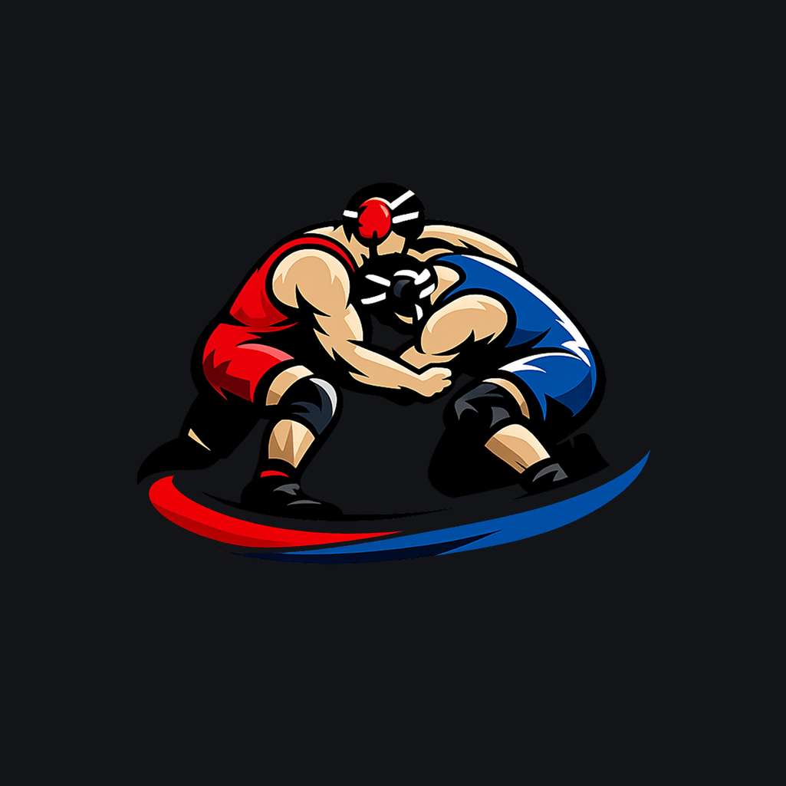

<div align="center">
  

# Solo Wrestler

**Follow a real wrestling curriculum, adapted for solo training.**

An Ionic Angular app that gives beginner wrestlers a structured path for
practising fundamentals alone with minimal equipment.
</div>

## About the app

Solo Wrestler answers one practical question: **What should I train today, and
how should I complete it?**

Instead of presenting a loose exercise library, the app guides the athlete
through an ordered, phase-based curriculum. Each workout combines concise
coaching cues, technique videos, repetition targets, and timed drills. Progress
is stored locally on the device, with no account or backend required.

> [!CAUTION]
> Train only on a safe mat surface. Keep your head up and protect your neck.
> Solo Wrestler provides general training guidance; it is not a replacement for
> professional coaching or medical advice.

## Features

- Guided curriculum with workouts unlocked in sequence
- Clear **Today** screen showing the next workout
- Duration-, repetition-, and round-based drills
- Work and rest timers with sound and vibration alerts
- In-app technique videos
- Resumable workouts and drill-by-drill completion tracking
- Workout history with difficulty ratings and optional notes
- Local-only progress with no sign-up
- Installable Progressive Web App (PWA)
- Native Android and iOS projects powered by Capacitor

## Built with

- [Angular](https://angular.dev/) 20
- [Ionic Angular](https://ionicframework.com/docs/angular/overview) 8
- [Capacitor](https://capacitorjs.com/) 8
- [Vitest](https://vitest.dev/)
- TypeScript and SCSS

## Getting started

### Prerequisites

- Node.js 20.19+ or 22.12+ LTS
- npm
- [Ionic CLI](https://ionicframework.com/docs/cli)

Native builds also require Android Studio for Android or Xcode on macOS for
iOS.

### Install and run

```bash
git clone https://github.com/dimitarradulov/solo-wrestler-app.git
cd solo-wrestler-app
npm install
ionic serve
```

The development server opens the app in a browser with live reload.

## Native development

Build the web app and sync it to both native projects:

```bash
ionic capacitor sync
```

Run the app on a selected device or emulator:

```bash
npx cap run android
npx cap run ios
```

Or open a native project in its platform IDE:

```bash
npx cap open android
npx cap open ios
```

Pass `android` or `ios` to `ionic capacitor sync` to sync only one platform.

## Development commands

| Command | Purpose |
| --- | --- |
| `ionic serve` | Start the local development server |
| `ionic build` | Create a production web build in `www/` |
| `ionic capacitor sync` | Build and sync web assets and native dependencies |
| `npm test` | Run the Vitest unit test suite |
| `npm run lint` | Check TypeScript and Angular templates with ESLint |

## Project structure

```text
src/app/
├── core/                  # App shell and platform-wide services
└── features/
    ├── about/             # About, equipment, and safety information
    └── training/          # Curriculum, workouts, progress, and session state

android/                   # Capacitor Android project
ios/                       # Capacitor iOS project
docs/                      # Product, design, and architecture documentation
```

## Documentation

- [Product requirements](docs/PRD.md)
- [Design specification](docs/DESIGN.md)
- [Domain language](CONTEXT.md)
- [Architecture decisions](docs/adr/)
- [PWA support notes](docs/pwa-support.md)

## Current scope

Solo Wrestler is an MVP focused on one local, guided curriculum. It does not
currently include accounts, cloud sync, custom workouts, AI coaching, social
features, or background notifications. Technique videos require an internet
connection; training progress remains on the device where it was recorded.

## Attribution

The curriculum is based on the
[USA Wrestling Core Curriculum](https://www.usawmembership.com/usa_wrestling_core_curriculum)
and adapted for solo practice and self-defense. Technique videos and curriculum
inspiration come from USA Wrestling's publicly available resources.
